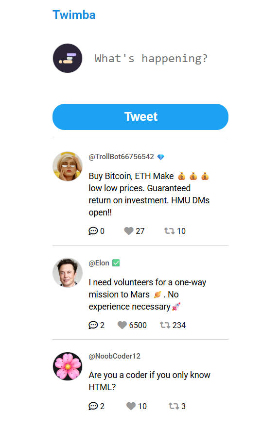

# 🌸Twimba – A Mini Twitter Clone 

> A lightweight Twitter clone built with JavaScript, HTML, and CSS — post tweets, like, and reply in real-time! Perfect for practicing DOM manipulation, event handling, and dynamic UI updates.

---

## 🪞 Overview  
Twimba is a simplified version of Twitter built for learning modern JavaScript concepts. It lets users write tweets, like or retweet posts, and view replies — all dynamically updated using JavaScript.  
It’s designed for beginners and frontend learners who want to strengthen their DOM manipulation and event-handling skills through a fun, interactive project. 
---

## 🚀 Features  
- 📝 Post new tweets  
- 💖 Like and unlike tweets  
- 🔁 Retweet posts  
- 💬 Toggle replies dynamically  
- 🪄 Real-time feed rendering with JavaScript   

---

## 🧱 Tech Stack  

| Technology | Purpose |
|-------------|----------|
| **HTML5** | Structure of the app |
| **CSS3** | Styling and layout |
| **JavaScript (ES6)** | Logic, rendering, and interactivity |
| **UUID (CDN)** | Unique tweet ID generation |
| **Font Awesome** | Icons for likes, retweets, and replies |

---

## 📚 What We Have Studied  

Here are the key JavaScript concepts or tools covered while building this project 🧩  

> Concepts covered:  
> - `textarea`  
> - `.forEach()`  
> - Data attributes  
> - Conditional rendering  
> - NOT operator `(!)`  
> - CDNs  
> - Adding icons  
> - Generating UUIDs    

---

## 🌿 Lessons Learned  

> - Strengthened understanding of **DOM manipulation** and **event handling**  
> - Learned to **conditionally render** UI elements efficiently  
> - Improved ability to **structure modular, readable JavaScript code**  

---

## 🖼️ Screenshots / Demo  

  

🔗 **Live Demo:** [https://your-demo-link.vercel.app](https://your-demo-link.vercel.app)  

---

## 💫 Author  
👩‍💻 **Created by [Your Name](https://github.com/yourusername)**  
> _“Build. Break. Learn. Repeat.”_ 🌸  

---
